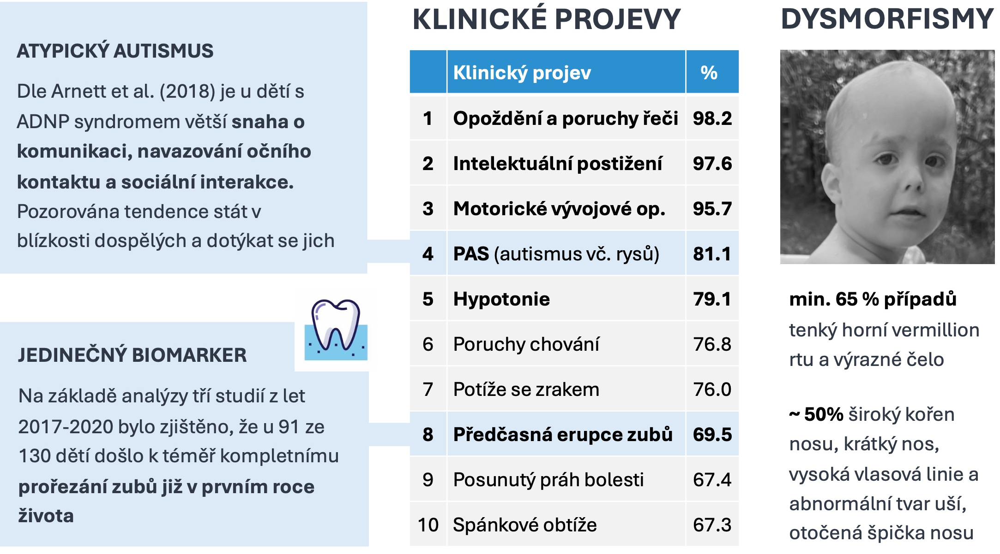
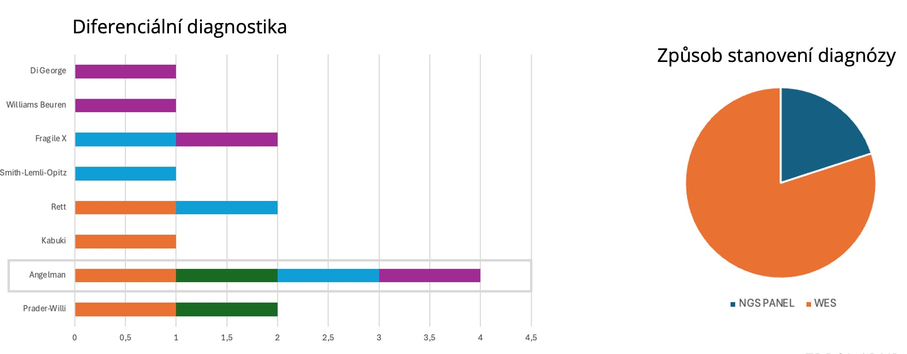
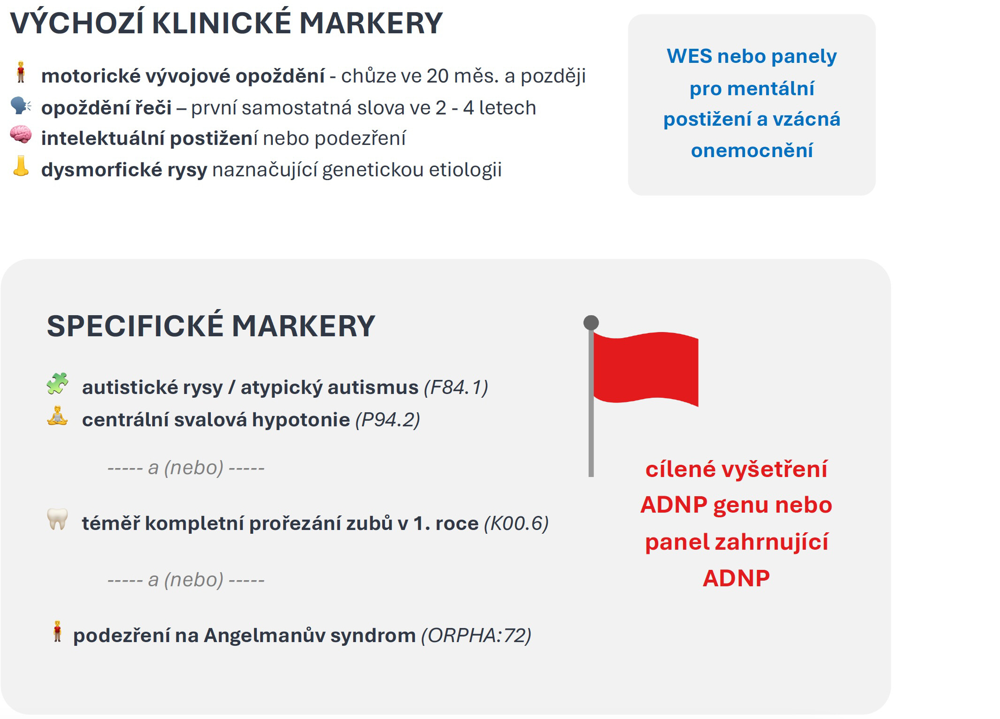

**Kontaktní údaje**

- Miroslav Holec, mirek@miroslavholec.cz, tel.: 773 272 767

Osobní setkání je možné během <a href="https://csklg.cz">1.ČS kongresu lékařské genetiky</a> v Luhačovicích. Na místě budu dostupný ve středu, 2. dubna mezi 12:00 a 17:00.

### Ke stažení

- [Abstrakt (PDF)](https://adnpasociace.cz/doc/HolecMiroslav_Csklg2025_PP_Abstrakt_ADNP.pdf)
- [Poster (PDF, A1)](https://adnpasociace.cz/doc/HolecMiroslav_Csklg2025_PP_Poster_ADNP.pdf)

ADNP syndrom (ORPHA: 404448, OMIM: 615873) představuje vzácné neurovývojové onemocnění způsobené heterozygotními mutacemi v genu ADNP na chromozomu 20q13.13. Navzdory tomu, že jde o nejčastější známou monogenní příčinu poruch autistického spektra s odhadovanou prevalencí 0,17 % všech PAS[^1], zůstává v klinické praxi značně poddiagnostikován. Definitivní potvrzení diagnózy ADNP syndromu je založeno na identifikaci patogenních variant v genu ADNP prostřednictvím sekvenačních metod, nejčastěji celoexomového sekvenování nebo cíleného sekvenování genového panelu.

> Tato práce syntetizuje současné poznatky o genetickém pozadí ADNP syndromu a zaměřuje se na identifikaci specifických klinických markerů, které by měly vést lékaře k indikaci cíleného genetického testování na přítomnost mutací v genu ADNP. 

Metodika zahrnuje extrakci klinických příznaků z odborné literatury, probíhající mezinárodní kvalitativní dotazníkové šetření v komunitě rodin dětí s ADNP syndromem a kvalitativní analýzu anamnézy diagnostikovaných pacientů s ADNP syndromem v ČR. 

## Klinické projevy u pacientů s ADNP syndromem

Analýza vychází z dat čtyř studií publikovaných v letech 2014 až 2020, které dohromady zahrnují celkem 174 subjektů. Vzhledem k možnému překryvu mezi jednotlivými studiemi nelze vyloučit opakování některých subjektů. Frekvence výskytu byla stanovena na základě souhrnných údajů ze všech čtyř studií.

## Diferenciální diagnostika u pacientů v ČR

Retrospektivní analýza zdravotní dokumentace pacientů s ADNP syndromem v České republice se zaměřila na molekulárně-genetická vyšetření provedená před stanovením finální diagnózy. **Ve čtyřech z pěti případů bylo původně vysloveno podezření na Angelmanův syndrom**; u těchto pacientů byla následně konečná diagnóza potvrzena metodou sekvenování celého exomu (WES).

## Indikační markery pro testování genu ADNP

Na základě poznatků formulujeme indikační kritéria pro cílené genetické testování ADNP genu založená na specifických fenotypových projevech, přičemž důraz klademe na snadno identifikovatelné klinické markery dostupné v primární a specializované pediatrické péči. 

Charakteristický klinický fenotyp, který zahrnuje kombinaci globálního vývojového opoždění, opoždění řeči, intelektuálního postižení, atypických rysů PAS, hypotonie a unikátního biomarkeru v podobě předčasné erupce chrupu, představuje základ pro včasnou indikaci cíleného genetického testování. 

> Vzhledem k vysoké míře klinického překryvu a častým diagnostickým záměnám by měla být suspekce na Angelmanův syndrom považována za indikaci k zahrnutí ADNP syndromu do užší diferenciální diagnostiky a zvážení cíleného molekulárně genetického testování. 

Implementace těchto indikačních kritérií do klinické praxe může významně zvýšit záchyt pacientů s ADNP syndromem a umožnit jejich včasný přístup k specializované péči a raným intervencím.

### Zdroje

[^1]: [https://doi.org/10.1038/ng.2899](https://doi.org/10.1038/ng.2899)

- [https://doi.org/10.1002/aur.1980](https://doi.org/10.1002/aur.1980)
- [https://doi.org/10.1016/j.ajhg.2020.07.003](https://doi.org/10.1016/j.ajhg.2020.07.003)
- [https://doi.org/10.1038/tp.2017.27](https://doi.org/10.1038/tp.2017.27)
- https://doi.org/10.1016/j.biopsych.2018.02.1173
- [https://doi.org/10.1038/ng.2899](https://doi.org/10.1038/ng.2899)
- [https://doi.org/10.1038/tp.2017.27](https://doi.org/10.1038/tp.2017.27)