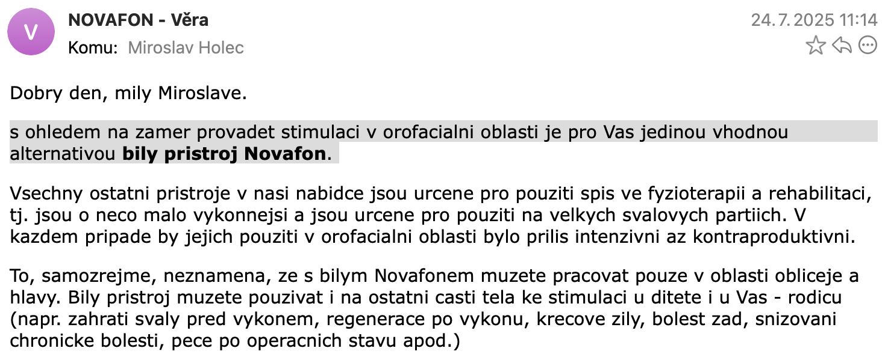

Přibližně 80 % pacientů s ADNP syndromem trpí centrální hypotonií.[^https://zenodo.org/records/15105491] Příčinou centrální hypotonie je narušená funkce centrálního nervového systému, zejména oblastí mozku a míchy, které řídí svalové napětí a koordinaci pohybů. První projevy lze často pozorovat již v kojeneckém věku. [^https://www.ncbi.nlm.nih.gov/books/NBK562209]

Hypotonie se projevuje slabým držením těla, omezenou stabilitou při sedu či stání, nekoordinovanou a méně jistou chůzí, ale také obtížemi při polykání v důsledku oslabení orofaciální oblasti. U některých dětí jsou přítomny i potíže s jemnou i hrubou motorikou, opožděný motorický vývoj, zvýšená únava při fyzické aktivitě a omezená schopnost provádět složitější pohyby vyžadující přesnou koordinaci. [^https://www.ncbi.nlm.nih.gov/books/NBK562209]

Prostředí, ve kterém se děti pohybují se musí bezpečně upravit, jelikož jejich chůze bývá nejistá a dochází častěji k pádům. V důsledku omezené koordinace mají děti výrazné obtíže v oblasti sebeobsluhy a jsou ve větší míře závislé na pomoci pečujících osob. Oslabené orofaciální svalstvo vede k častější slintavosti a může způsobovat potíže při příjmu potravy od obtížného uchopení a udržení lžičky až po samotné žvýkání a polykání jídla. Oslabení svalstva v oblasti obličeje má vliv i na vývoj řeči.

> REFERENCE RODIČU

### Péče o děti s hypotonií

V praxi se pro zlepšení hypotonie uplatňuje multidisciplinární péče, která zahrnuje:

- fyzioterapie (posílení svalů, stability, koordinace, různé přístupy)
- ergoterapie (praktické dovednosti, jemná motorika)
- logopedie (posílení svalů obličeje, rtů, jazyka a čelistí)
- doplňující metody: hipoterapie, plavání, snoezelen
- využití rehabilitačních a speciálních pomůcek

## Novafon

Mezi speciální pomůcky patří i zařízení Novafon, které spadá především do logopedické praxe. Novafon umožňuje pečujícím osobám v domacím prostředí stimulovat svaly a nervová zakončení, zlepšit prokrvení a podporovat aktivaci oslabených svalových skupin. Zásadní význam má v orofaciální oblasti, protože zlepšuje funkci rtů, tváří a jazyka. Zlepšuje nejen podmínky pro rozvoj řeči u dětí s hypotonií, ale též pomáhá s obtížemi s polykáním. [^https://www.novafon.cz/logopedie]

> NÁZOR SPECIALISTY

Vibrační přístroje Novafon patří mezi zdravotnické prostředky třídy IIa a mají certifikaci jakosti dle ISO 13485:2016. Novafon byl registrován jako zdravotní pomůcka u Státního ústavu pro kontrolu léčiv (SÚKL) do 31. 12. 2024. [^https://eregpublicsecure.ksrzis.cz/Registr/RZPRO/ZdravotnickyProstredek/Detail/177202]

Studie z konce roku 2024 prokázala účinnost terapií u dětí s dysfagií prováděných s Novafonem po dobu 8 týdnů (3x týdně po 20 min). Studie zdůrazňuje, že fokální vibrační terapie pomocí zařízení Novafon může sloužit jako účinný a podpůrný přístup v rámci konvenční terapie dysfagie u dětí. [^https://doi.org/10.1111/joor.13900] Jiná studie z roku 2018 prokázala u malého vzorku dospělých statisticky významné zlepšení dysfonie během pětitýdenního programu. [^https://doi.org/10.1080/14015439.2018.1453541]

## Jak začít s Novafonem

V České republice je Novafon dostupný prostřednictvím e-shopu [novafon.cz](https://www.novafon.cz/), který je provozován společností Juris Active, s.r.o., stejně jako například e-shop [kousak.com](https://www.kousak.com/). Oba e-shopy poskytují užitečné pomůcky pro děti se speciálními potřebami a jsou důvěryhodné. V současné době se prodává hned několik variant Novafonu. Chcete-li používat Novafon i pro stimulaci orofaciální oblasti, doporučuje prodejce klasický bílý Novafon.

Součástí balení jsou dva základní nástavce, které lze doplnit řadou dalších nástavců dle doporučení logopeda. Nástavce lze dokupovat na již uvedeném e-shopu.

Některá zdravotnická pracoviště Novafon využívají v klinické praxi již několik let a v poslední době se objevují také specializované kurzy a workshopy určené zdravotnickým odborníkům i pečujícím osobám. Pro zahájení práce s Novafonem lze vyhledat podporu zkušeného ergoterapeuta či klinického logopeda, případně využít nabídku online konzultací poskytovaných různými centry.

> Doporučení pro práci s Novafone nám poskytla konzultace s logopedem z centra multismyslové terapie, [Kouzelen](https://obchod.kouzelen.cz/konzultace-online/). Díky cenným radám jsem mohli Novafon okamžitě začít používat. Zároveň jsme dostali doporučení na několik odborníků pro další konzultace. (Miroslav Holec)

Přímo v e-shopu novafon.cz lze dále zakoupit příručku [Tipy a návody pro práci s přístrojem NOVAFON](https://www.novafon.cz/tipy-a-navody-pro-praci-s-pristrojem-novafon--v-nem-jazyce/), která je v německém jazyce a poskytuje základní tipy pro použití Novafone. Příručka se však nevěnuje specifickému použití u dětí ani se hlouběji nezaměřuje na orofaciální stimulaci.

### Závěr

Hypotonie u dětí vyžaduje komplexní multidisciplinární péči zaměřenou na posílení svalů, koordinace a sebeobslužných dovedností. Zařízení Novafon může v domácím prostředí efektivně podpořit orofaciální i celkovou svalovou stimulaci a tím přispět k lepšímu vývoji řeči a polykání.
Úspěšné zapojení Novafonu do péče vyžaduje odborné vedení a vhodnou volbu nástavců i technik podle individuálních potřeb dítěte.
