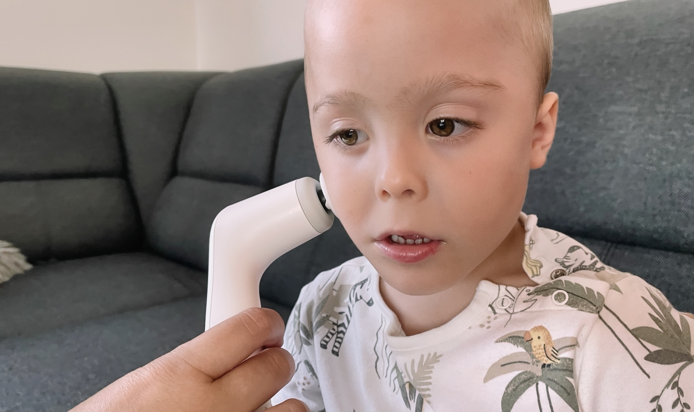

Přibližně 80 % pacientů s ADNP syndromem trpí centrální hypotonií.[^https://doi.org/10.1016/j.biopsych.2018.02.1173] Příčinou centrální hypotonie je narušená funkce centrálního nervového systému, zejména oblastí mozku a míchy, které řídí svalové napětí a koordinaci pohybů. Ačkoli hypotonie může mít prenatální, perinatální i postnatální příčiny, v případě ADNP syndromu se jedná převážně o geneticky podmíněnou centrální poruchu, jejíž první projevy lze často pozorovat již v kojeneckém věku. [^https://www.ncbi.nlm.nih.gov/books/NBK562209]

Hypotonie se projevuje slabým držením těla, omezenou stabilitou při sedu či stání a nekoordinovanou, méně jistou chůzí. V důsledku omezené koordinace mají děti výrazné obtíže v oblasti sebeobsluhy a jsou ve větší míře závislé na pomoci pečujících osob. U některých dětí se vyskytují potíže s jemnou i hrubou motorikou, zvýšená únava při fyzické aktivitě a snížená schopnost provádět pohyby vyžadující přesnou koordinaci. [^https://www.aacpdm.org/publications/care-pathways/central-hypotonia]

Hypotonie se projevuje také obtížemi při polykání v důsledku oslabení orofaciální oblasti. Oslabené orofaciální svalstvo vede ke zvýšené salivaci a může též způsobovat potíže při příjmu potravy od obtížného uchopení a udržení lžičky až po poruchy žvýkání a polykání jídla. Svalová nedostatečnost v oblasti obličeje často vede i k opoždění či narušení vývoje řeči. [^https://my.clevelandclinic.org/health/diseases/22223-hypotonia-in-babies] 

### Péče o děti s hypotonií

V praxi se pro zlepšení hypotonie uplatňuje multidisciplinární péče, která zahrnuje:

- fyzioterapie (posílení svalů, stability, koordinace, různé přístupy)
- ergoterapie (praktické dovednosti, jemná motorika)
- logopedie (posílení svalů obličeje, rtů, jazyka a čelistí)
- doplňující metody: hipoterapie, plavání, snoezelen
- využití rehabilitačních a speciálních pomůcek

Tento článek se zaměřuje především na důsledky hypotonie v oblasti obličeje. Aby se mohla řeč vyvíjet, je potřeba začít budovat základní stavební kámen - motoriku, kam se řadí i oromotorika, kterou lze posílit různými speciálními pomůckami. Jednou z těchto pomůcek je Novafon.

## Novafon

Novafon patří mezi speciální pomůcky, které se využívají především v logopedické praxi. Přístroj umožňuje v domácím prostředí provádět vibrační stimulaci svalů a nervových zakončení, čímž může napomoci prokrvení a aktivaci oslabených svalových skupin. V orofaciální oblasti může podpořit funkci rtů, tváří a jazyka a tím vytvářet příznivější podmínky pro rozvoj řeči či zvládání obtíží s polykáním u dětí s hypotonií. [^https://www.novafon.cz/logopedie] 

Pro využití Novafonu u dětí s centrální hypotonií zatím neexistují klinické studie. Účinky vycházejí především z klinické praxe logopedů a z individuálních zkušeností.

> Novafon při ergoterapii využíváme již několik let. Jeho použití je všestranné, dá se využít při bolestech zad, svalů, kloubů. U DMO pro uvolnění spastických svalů, u dětí s hypotonií zase naopak k aktivizaci a posílení svalů.  Má dva typy vibrací, které stimulují sval ke stahu i uvolnění.  Velké zastoupení má při orofaciální stimulaci. K dispozici máme několik nástavců. Pasivním působením vibrací dokáže nastimulovat pohyb jazyka a svalů orofaciální oblasti. U většiny dětí dochází po orofaciální stimulaci Novafonem i k aktivnímu pohybu jazyka a svalů DÚ, čímž se dětem zlepší příjem stravy a možnost verbální komunikace. Za dobu co používáme Novafon, což je již 7 let, pomohl Novafon již stovkám dětí. ([Centrum ergoterapie Herynka](https://www.herynka.cz/))

Vibrační přístroje Novafon patří mezi zdravotnické prostředky třídy IIa a má certifikaci jakosti dle ISO 13485:2016. Novafon byl registrován jako zdravotní pomůcka u Státního ústavu pro kontrolu léčiv (SÚKL) do 31. 12. 2024 [^https://eregpublicsecure.ksrzis.cz/Registr/RZPRO/ZdravotnickyProstredek/Detail/177202]. 

Studie z konce roku 2024 prokázala účinnost terapií u dětí s dysfagií prováděných s Novafonem po dobu 8 týdnů (3x týdně po 20 min). Studie zdůrazňuje, že fokální vibrační terapie pomocí zařízení Novafon může sloužit jako účinný a podpůrný přístup v rámci konvenční terapie dysfagie u dětí. [^https://doi.org/10.1111/joor.13900] Jiná studie z roku 2018 prokázala u malého vzorku dospělých statisticky významné zlepšení dysfonie během pětitýdenního programu. [^https://doi.org/10.1080/14015439.2018.1453541]

## Jak začít s Novafonem

V České republice je Novafon dostupný prostřednictvím e-shopu [novafon.cz](https://www.novafon.cz/), který je provozován společností Juris Active, s.r.o., stejně jako například e-shop [kousak.com](https://www.kousak.com/). Na českém trhu je dostupných několik variant přístroje, které se liší designem a výbavou. Pro použití v orofaciální oblasti se obvykle využívá základní model (klasický bílý Novafon). Součástí balení jsou dva základní nástavce, které lze doplnit řadou dalších nástavců dle doporučení logopeda. Nástavce lze dokupovat na již uvedeném e-shopu.

Některá zdravotnická pracoviště Novafon využívají v klinické praxi již několik let a v poslední době se objevují také specializované kurzy a workshopy určené zdravotnickým odborníkům i pečujícím osobám. Novafon lze individuálně kombinovat i s dalšími přístupy, například v multisenzorickém prostředí Snoezelen. Pro zahájení práce s Novafonem lze vyhledat podporu zkušeného ergoterapeuta či klinického logopeda, případně využít nabídku online konzultací poskytovaných různými centry.

> Doporučení pro práci s Novafonem jsme získali během konzultace s logopedem z centra multismyslové terapie [Kouzelen](https://obchod.kouzelen.cz/konzultace-online/). Díky cenným radám jsme mohli přístroj okamžitě začít používat. Prakticky od začátku u syna pozorujeme stimulaci svalů a jejich aktivní zapojení během procedury. Zároveň jsme dostali doporučení na další odborníky pro specializované konzultace. (Miroslav Holec, otec [Lukáška](https://adnpasociace.cz/pribehy/lukasek))

Přímo v e-shopu novafon.cz lze dále zakoupit příručku [Tipy a návody pro práci s přístrojem NOVAFON](https://www.novafon.cz/tipy-a-navody-pro-praci-s-pristrojem-novafon--v-nem-jazyce/), která je v německém jazyce a poskytuje základní tipy pro použití Novafone. Příručka se však nevěnuje specifickému použití u dětí ani se hlouběji nezaměřuje na orofaciální stimulaci.

### Závěr

Hypotonie u dětí vyžaduje komplexní multidisciplinární péči zaměřenou na posílení svalů, koordinace a sebeobslužných dovedností. Zařízení Novafon může v domácím prostředí efektivně podpořit orofaciální i celkovou svalovou stimulaci a tím přispět k lepšímu vývoji řeči a polykání. Úspěšné zapojení Novafonu do péče vyžaduje odborné vedení a vhodnou volbu nástavců i technik podle individuálních potřeb dítěte.
